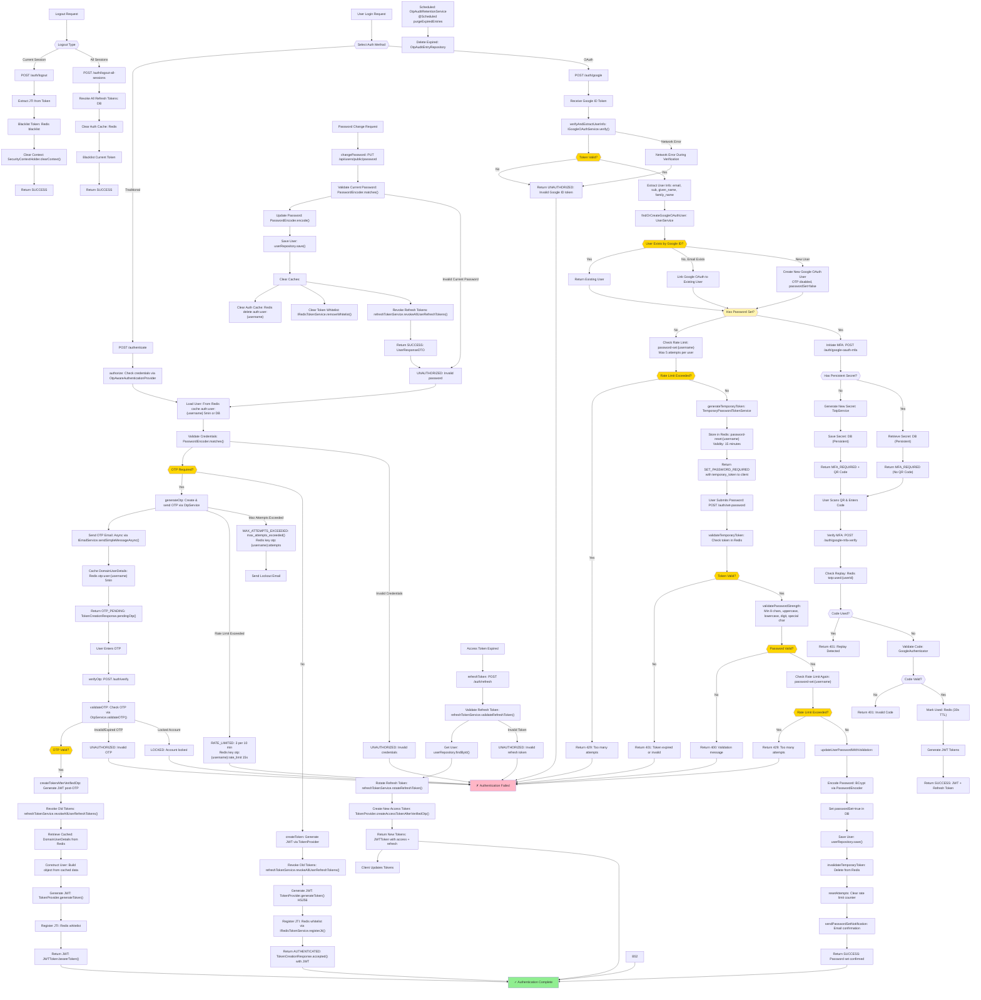

# Spring Boot OTP Authentication Flowchart

**Token & Configuration Specifications:**
- **JWT Token**: Expiry 5 minutes, Algorithm HS256, stored in Redis whitelist
- **Refresh Token**: Expiry 7 days, rotated on refresh, revoked on password change
- **OTP**: Expiry 5 minutes, Max 3 attempts per 10 minutes, Rate limit 15s
- **Temporary Token**: Expiry 15 minutes, Rate limit max 5 password set attempts per user
- **User Cache**: 5 minutes (auth:user:{username})
- **OTP Cache**: 5 minutes (otp:user:{username})

## Latest Flows Implemented

### 1. Standard Email/Password Flow
- User submits credentials via `/auth/authenticate`
- `OtpAwareAuthenticationProvider` validates credentials
- If OTP required: Generate & email OTP, return `OTP_PENDING`
- If OTP disabled: Generate & return JWT token immediately
- User accesses protected endpoints with JWT

### 2. OTP-Based Authentication Flow
- After successful credential validation with OTP enabled
- OTP generated (max 3 per 10 min, expires 5 min)
- User enters OTP via `/auth/verify`
- System validates OTP and generates JWT
- User details cached during OTP wait and retrieved after validation

### 3. Google OAuth Flow - New User with Password Setup
- User initiates Google login → `/auth/google`
- System verifies token with Google OAuth service
- New user created with `passwordSet=false`
- Temporary token generated (15 min validity)
- System returns `SET_PASSWORD_REQUIRED` with temporary token
- User must set password via `/auth/set-password`:
  - **Password Validation**: Min 8 chars, uppercase, lowercase, digit, special char
  - **Rate Limiting**: Max 5 attempts per user
  - **Token Validation**: Temporary token must be valid
  - **Processing**: BCrypt encoding, `passwordSet=true`, confirmation email
  - **Token Cleanup**: Temporary token invalidated after success

### 4. Google OAuth Flow - Returning User (MFA Enabled)
- User initiates Google login → `/auth/google-oauth-mfa`
- Token verified, existing user found
- System checks `passwordSet` flag
- If password set:
  - **Check Persistent Secret**: Does user have a stored TOTP secret?
  - **No (First Time)**: Generate new secret, save to DB, return QR Code
  - **Yes (Returning)**: Retrieve secret, return `MFA_REQUIRED` (no QR Code)
- User verifies via `/auth/google-mfa-verify`:
  - **Replay Protection**: Check Redis if code was used in last 30s
  - **Validation**: Verify code against stored secret
  - **Success**: Mark code as used (Redis), issue JWT tokens

### 5. Password Setup with Temporary Token
- Triggered by OAuth new user flow
- **Rate Limit Check** (max 5 per user): `password-set:{username}`
- **Token Generation**: 15-minute validity in Redis (`password-reset:{username}`)
- **Password Submission**: `/auth/set-password` validates:
  - Temporary token exists and is valid
  - Password meets all strength requirements
  - Rate limit not exceeded on attempt
- **Success Flow**: BCrypt encode, set flag, invalidate token, send email
- **Error Handling**: 400 (validation), 401 (token), 429 (rate limit)

### 6. Token Refresh Flow
- When JWT access token expires (5 min)
- Client submits refresh token via `/auth/refresh`
- System validates refresh token (7 day validity)
- Token rotation: Old refresh token revoked, new one issued
- New access token generated and returned
- Seamless token renewal without re-authentication

### 7. Logout Flow
- **Current Session**: `/auth/logout` invalidates current JWT via Redis blacklist
- **All Sessions**: `/auth/logout-all-sessions` revokes all refresh tokens and clears caches

### 8. Password Change Flow
- User changes password: `PUT /api/users/public/password`
- Current password validated
- New password encoded with BCrypt
- **Cache Cleanup**:
  - Clear auth cache: `auth:user:{username}`
  - Clear token whitelist: `IRedisTokenService.removeWhitelist()`
  - Revoke all refresh tokens
- Next login forced to use fresh DB data
- All existing sessions invalidated

### Password Setup Security Features
- **Temporary Token System**: Short-lived tokens (15 min) stored in Redis with automatic expiration
- **Rate Limiting**: Max 5 password set attempts per user prevents brute force attacks
- **Password Strength Validation**: 
  - Minimum 8 characters
  - Must contain uppercase letter
  - Must contain lowercase letter
  - Must contain digit
  - Must contain special character
- **BCrypt Hashing**: Industry-standard password encryption
- **Token Invalidation**: Temporary tokens cleared after successful password set
- **Email Confirmation**: User notified of successful password setup
- **Graceful Error Handling**: Specific HTTP status codes (400, 401, 429)

### Security Features Across All Flows
- **JWT Signature Validation**: HS256 algorithm with secret key
- **Token Expiration**: Access tokens (5 min), Refresh tokens (7 days)
- **Redis Whitelist**: Tokens registered and validated against Redis
- **Token Rotation**: Refresh tokens rotated on use, old tokens revoked
- **Password Change Cache Invalidation**: All caches and tokens cleared on password change
- **OTP Security**: Time-based expiration, max attempt tracking, lockout mechanism
- **Persistent TOTP**: Secrets stored in DB, replay protection via Redis (30s TTL)
- **Rate Limiting**: Multiple layers - OTP (3/10min), Password Set (5/user), OAuth (10/min)
- **Audit Trails**: OTP generation and verification logged for compliance

### Authentication Decision Points (Color Coded Yellow)
1. **OTP Required?** (Flow F) - User OTP setting check
2. **Token Valid?** (Flow B5) - Google OAuth token verification
3. **User Exists?** (Flow B10) - New vs existing user determination
4. **Has Password Set?** (Flow B20) - OAuth user password requirement check
5. **Rate Limit Exceeded?** (Flows B22, B35) - Rate limit checks
6. **Token Valid?** (Flow B29) - Temporary token validation
7. **Password Valid?** (Flow B32) - Password strength validation
8. **OTP Valid?** (Flow R) - OTP verification

### Flow Connections
- Dual authentication entry points: Traditional email/password + Google OAuth
- Password setup flow triggered only for new OAuth users without passwords
- Password change connects back to authentication via cache clearing
- Refresh token flow seamlessly extends access token validity
- Comprehensive error paths with specific HTTP status codes
- All success paths converge at authentication completion
- Scheduled background cleanup of expired OTP audit entries

### System Architecture Highlights
- **Service Layer**: Separated concerns with dedicated services for OTP, OAuth, Password Setup, Tokens
- **Redis Integration**: Multi-purpose caching for user data, tokens, rate limits, temporary tokens
- **Database Persistence**: User profiles, OAuth metadata, audit trails
- **Async Email**: Non-blocking email delivery for OTP and notifications
- **Transaction Management**: ACID compliance for password updates
- **Monitoring & Logging**: Comprehensive logging at all decision points