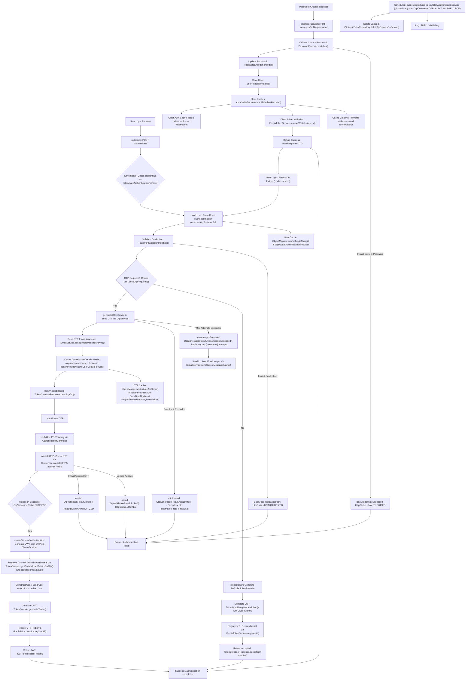

# Spring Boot OTP Authentication Flowchart

## Key Changes Made

### Password Change Integration
- **Added password change flow** (`AAA` → `III`) showing the complete process
- **Cache clearing mechanism** (`FFF` → `HHH`) that clears both auth cache and token whitelist
- **Cache impact** (`III` → `JJJ`) showing how password changes force fresh DB lookups

### Security Improvements
- **Immediate cache invalidation** prevents authentication with old passwords
- **Token whitelist clearing** ensures old JWTs are invalidated
- **Fresh DB lookup** guarantees latest user data is used

### Flow Connections
- Password change success connects back to authentication flow
- Cache clearing prevents stale authentication data
- Error handling for invalid current passwords

This updated flowchart reflects the security improvements made to ensure password changes take effect immediately across the authentication system.