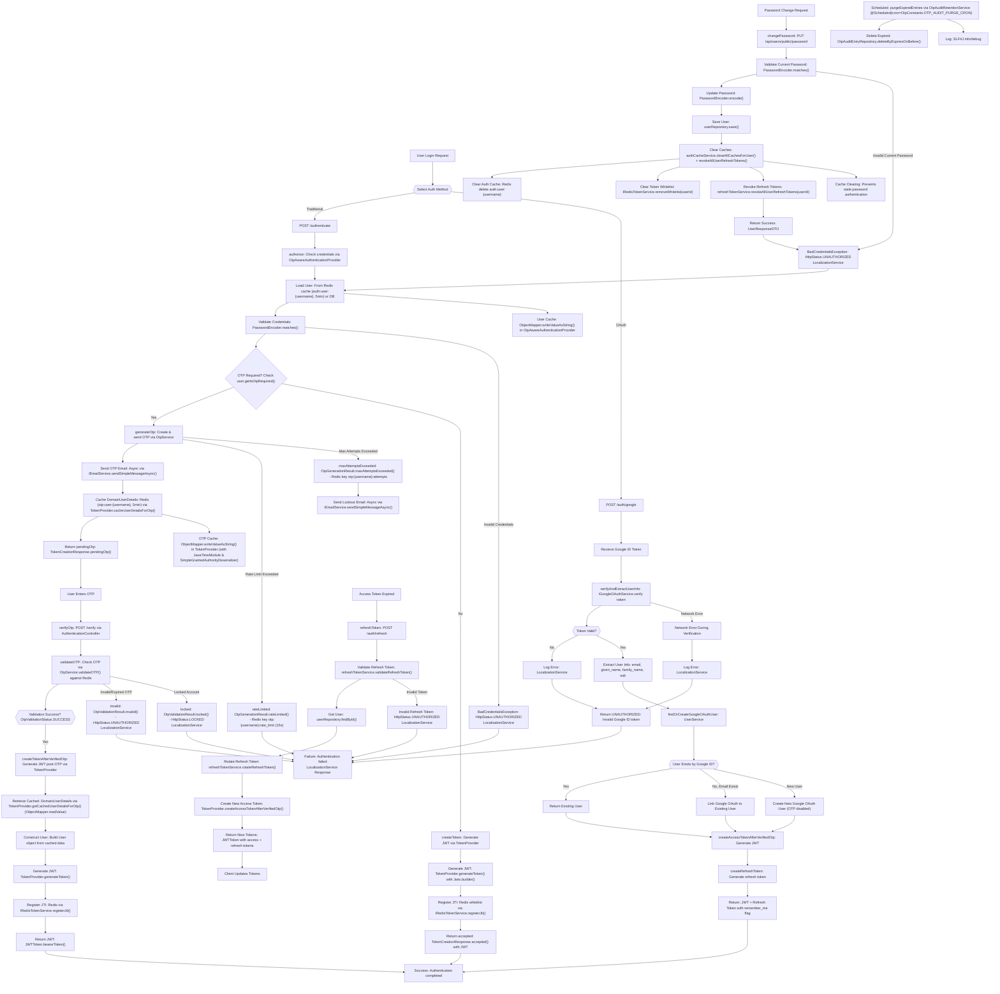

# Spring Boot OTP Authentication Flowchart

## Key Changes Made

### Google OAuth Integration
- **Added OAuth authentication path** (`B2` → `B16`) as alternative to traditional login
- **Token verification** (`B4` → `B5`) via IGoogleOAuthService.verifyAndExtractUserInfo()
- **User management** (`B9` → `B13`) with three scenarios:
  - Existing Google OAuth user authentication
  - Linking Google OAuth to existing email-based account
  - Creating new Google OAuth users (OTP disabled by default)
- **Automatic token generation** for OAuth users without OTP requirement
- **Refresh token support** for OAuth flows with remember_me flag
- **Error handling** for invalid/expired tokens with proper HTTP status codes

### Localization Service Integration
- **Error message localization** across all authentication paths:
  - Invalid credentials (Traditional auth)
  - Invalid/Expired OTP validation
  - Locked accounts
  - Invalid refresh tokens
  - Invalid Google ID tokens
  - Network errors during verification
- **Centralized messaging** via LocalizationService for consistent user experience
- **Multi-language support** for all error responses

### Password Change Integration
- **Added password change flow** (`AAA` → `JJJ`) showing the complete process
- **Enhanced cache clearing** (`FFF` → `III`) that clears auth cache, token whitelist, AND refresh tokens
- **Cache impact** (`JJJ` → `KKK`) showing how password changes force fresh DB lookups

### Refresh Token Implementation
- **Refresh token flow** (`LLL` → `SSS`) for seamless token renewal
- **Token rotation** (`PPP`) for enhanced security - old refresh tokens are revoked when new ones are issued
- **Updated access token creation** (`QQQ`) uses TokenProvider.createAccessTokenAfterVerifiedOtp() to avoid OTP-triggered side effects during refresh
- **Dual token response** - both access and refresh tokens returned on authentication and refresh

### Security Improvements
- **Immediate cache invalidation** prevents authentication with old passwords
- **Token whitelist clearing** ensures old JWTs are invalidated
- **Refresh token revocation** on password change prevents token reuse
- **Token rotation** prevents refresh token replay attacks
- **Fresh DB lookup** guarantees latest user data is used
- **OAuth user isolation** - Google OAuth users exempt from OTP requirements

### Flow Connections
- Dual authentication entry points (Traditional + OAuth)
- Password change success connects back to authentication flow
- Refresh token flow handles expired access tokens seamlessly
- Comprehensive error handling with localization for all authentication scenarios
- Scheduled cleanup for expired tokens and OTP entries

This updated flowchart reflects the complete JWT authentication system with Google OAuth support, refresh tokens, and multi-language error messaging, ensuring both security and enhanced user experience.